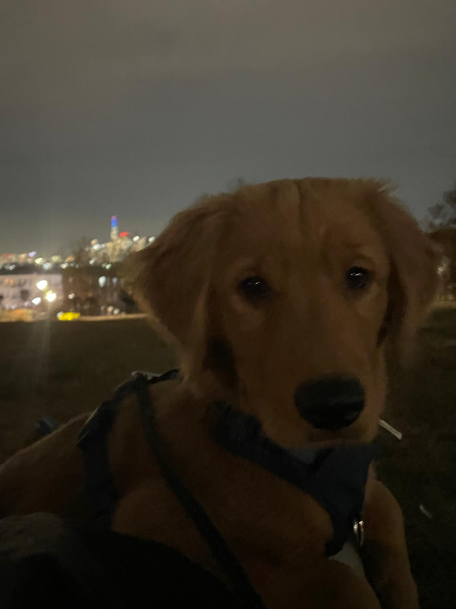

<h1 align="center"> Hi there! I'm Steven 👋 </h1>

  🚀 Aspiring Software Engineer | CS + Math minor @ CUNY Hunter College (2027)
   Exploring projects in social inequities, health tech, and small business solutions

  
   
  <strong>Meet Sunny ☀️: Entry Level Code Retriever</strong> 🐾

## 💼 Experience

### 🤖 Extern @ Outamation 
*Dec 2025 – Present*
- **AI Pipelines:** Built modular pipelines for 200+ page mortgage docs using OCR (Tesseract, PaddleOCR) and PyMuPDF.
- **RAG Systems:** Developed multi-document retrieval using **LlamaIndex**, optimizing chunking and metadata indexing for LLMs like Mistral and Phi-2.
- **Evaluation:** Designed a framework to assess OCR accuracy and pipeline throughput, delivering deployment-ready technical reports.

### 🧠 Data Analytics Researcher @ DataKind's Datakit
*March 2025 – May 2025*
- Structured and visualized economic disparity data for Kenya and the Philippines using **Pandas** and **NumPy**.
- Supported global financial inclusion efforts through data-driven research and visualization.

### 🖥️ IT Assistant @ NYC Department of Education
*May – June 2025*
- Troubleshot GUI components and hardware issues for students and faculty.
- Ensured software compliance with NYC DOE policies and optimized system performance.

---

## 💻 Tech Stack

| Category | Tools |
| :--- | :--- |
| **Languages** | C++, Python, Java, SQL, JavaScript, HTML/CSS, PowerShell |
| **Data & AI** | Pandas, NumPy, Matplotlib, LlamaIndex, OCR Tools |
| **Frameworks** | React, Tkinter |
| **Dev Tools** | Git, GitHub, VS Code, PyCharm, NetBeans |

---

  <em>✨ Always excited to learn, build, and make a difference through tech.</em>

